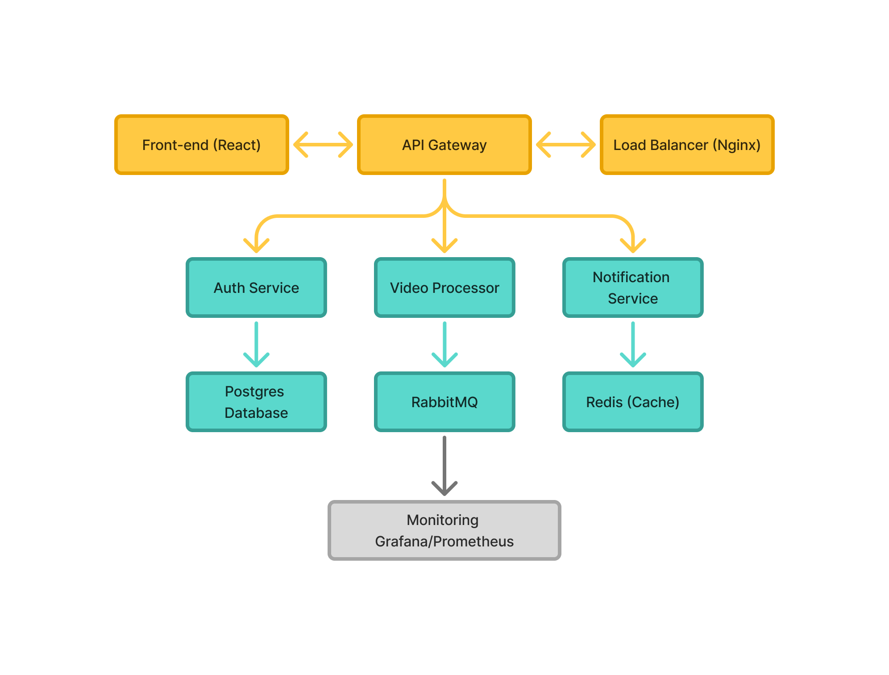

# Documentação da Arquitetura - FIAP X Video Processor

## Visão Geral

O FIAP X Video Processor é um sistema distribuído baseado em microsserviços para processamento de vídeos em larga escala. O sistema foi projetado seguindo os princípios de arquitetura de software moderna, incluindo escalabilidade, resiliência e observabilidade.

## Arquitetura de Alto Nível

## Componentes da Arquitetura

### 1. Frontend (React)
- **Tecnologia**: React 18 + Tailwind CSS + shadcn/ui
- **Responsabilidades**:
  - Interface de usuário responsiva
  - Autenticação de usuários
  - Upload de vídeos
  - Monitoramento de jobs
  - Download de resultados
- **Comunicação**: HTTP/HTTPS com API Gateway

### 2. API Gateway
- **Tecnologia**: Python Flask + Redis
- **Responsabilidades**:
  - Ponto de entrada único para todas as requisições
  - Roteamento para microsserviços
  - Rate limiting e throttling
  - Cache de respostas
  - Agregação de health checks
- **Padrões**: Gateway Pattern, Circuit Breaker

### 3. Auth Service
- **Tecnologia**: Python Flask + PostgreSQL + JWT
- **Responsabilidades**:
  - Autenticação de usuários
  - Autorização baseada em tokens JWT
  - Gerenciamento de usuários
  - Validação de tokens
- **Segurança**: Hash de senhas com bcrypt, tokens JWT com expiração

- **Tecnologia**: Python Flask + FFmpeg + RabbitMQ
- **Responsabilidades**:
  - Processamento assíncrono de vídeos
  - Extração de frames com FFmpeg
  - Criação de arquivos ZIP
  - Gerenciamento de jobs
  - Notificação de status
- **Padrões**: Producer-Consumer, Queue-based Processing

### 5. Notification Service 
- **Tecnologia**: Python Flask + SMTP
- **Responsabilidades**:
  - Envio de notificações por email
  - Processamento de mensagens da fila
  - Templates de email
  - Retry logic para falhas
- **Padrões**: Event-driven Architecture

### 6. Banco de Dados (PostgreSQL)
- **Tecnologia**: PostgreSQL 15
- **Responsabilidades**:
  - Persistência de dados de usuários
  - Histórico de jobs de processamento
  - Logs de notificações
  - Transações ACID
- **Padrões**: Database per Service

### 7. Cache (Redis)
- **Tecnologia**: Redis 7
- **Responsabilidades**:
  - Cache de sessões
  - Cache de respostas da API
  - Rate limiting
  - Dados temporários
- **Padrões**: Cache-aside, Write-through

### 8. Message Queue (RabbitMQ)
- **Tecnologia**: RabbitMQ 3
- **Responsabilidades**:
  - Processamento assíncrono
  - Desacoplamento de serviços
  - Garantia de entrega de mensagens
  - Dead letter queues
- **Padrões**: Publish-Subscribe, Work Queues

### 9. Monitoramento (Prometheus + Grafana)
- **Tecnologia**: Prometheus + Grafana
- **Responsabilidades**:
  - Coleta de métricas
  - Alertas automáticos
  - Dashboards visuais
  - Health monitoring
- **Padrões**: Observability, Metrics-driven

## Fluxos de Dados

### Fluxo de Autenticação
1. Usuário faz login no frontend
2. Frontend envia credenciais para API Gateway
3. API Gateway roteia para Auth Service
4. Auth Service valida credenciais no PostgreSQL
5. Auth Service gera token JWT
6. Token é retornado ao frontend
7. Frontend armazena token para requisições futuras

### Fluxo de Processamento de Vídeo
1. Usuário faz upload de vídeo no frontend
2. Frontend envia arquivo para API Gateway
3. API Gateway roteia para Video Processor
4. Video Processor salva arquivo e cria job no PostgreSQL
5. Video Processor publica mensagem na fila RabbitMQ
6. Worker consome mensagem e processa vídeo com FFmpeg
7. Worker atualiza status do job no PostgreSQL
8. Worker publica notificação na fila
9. Notification Service envia email ao usuário

### Fluxo de Monitoramento
1. Prometheus coleta métricas de todos os serviços
2. Métricas são armazenadas no Prometheus
3. Grafana consulta métricas do Prometheus
4. Dashboards exibem status em tempo real
5. Alertas são disparados em caso de problemas

## Padrões de Arquitetura Implementados

### 1. Microservices Architecture
- Serviços independentes e especializados
- Comunicação via APIs REST
- Banco de dados por serviço
- Deploy independente

### 2. API Gateway Pattern
- Ponto de entrada único
- Roteamento inteligente
- Cross-cutting concerns (auth, logging, rate limiting)

### 3. Event-Driven Architecture
- Comunicação assíncrona via mensagens
- Desacoplamento temporal
- Processamento em background

### 4. CQRS (Command Query Responsibility Segregation)
- Separação entre operações de leitura e escrita
- Otimização específica para cada tipo de operação

### 5. Circuit Breaker Pattern
- Proteção contra falhas em cascata
- Fallback automático
- Recovery automático

### 6. Bulkhead Pattern
- Isolamento de recursos
- Prevenção de falhas em cascata
- Containers separados

## Estratégias de Escalabilidade

### Escalabilidade Horizontal
- Múltiplas instâncias de cada serviço
- Load balancing automático
- Auto-scaling baseado em métricas

### Escalabilidade Vertical
- Aumento de recursos por container
- Otimização de performance
- Tuning de banco de dados

### Estratégias de Cache
- Cache de aplicação (Redis)
- Cache de banco de dados
- Cache de CDN para frontend

## Segurança

### Autenticação e Autorização
- JWT tokens com expiração
- Hash de senhas com bcrypt
- Validação de tokens em cada requisição

### Segurança de Rede
- HTTPS obrigatório
- CORS configurado
- Headers de segurança

### Segurança de Containers
- Usuários não-root
- Imagens mínimas
- Secrets management

## Observabilidade

### Métricas
- Métricas de aplicação (Prometheus)
- Métricas de infraestrutura
- Métricas de negócio

### Logs
- Logs estruturados
- Correlação de logs
- Agregação centralizada

### Tracing
- Distributed tracing
- Request correlation
- Performance monitoring

## Resiliência

### Fault Tolerance
- Circuit breakers
- Retry logic
- Timeout configuration

### Disaster Recovery
- Backup automático
- Recovery procedures
- Data replication

### High Availability
- Multiple instances
- Health checks
- Automatic failover

## Considerações de Performance

### Otimizações de Banco
- Índices otimizados
- Connection pooling
- Query optimization

### Otimizações de Cache
- Cache warming
- Cache invalidation
- TTL configuration

### Otimizações de Rede
- Compression
- Keep-alive connections
- CDN usage

## Deployment e DevOps

### Containerização
- Docker containers
- Multi-stage builds
- Optimized images

### Orquestração
- Docker Compose para desenvolvimento
- Kubernetes ready
- Service mesh ready

### CI/CD
- Automated testing
- Automated deployment
- Blue-green deployment

## Conclusão

A arquitetura do FIAP X Video Processor foi projetada para ser escalável, resiliente e observável. Utilizando padrões modernos de arquitetura de software e tecnologias comprovadas, o sistema é capaz de processar múltiplos vídeos simultaneamente, garantindo alta disponibilidade e performance.

A separação em microsserviços permite evolução independente de cada componente, facilitando manutenção e adição de novas funcionalidades. O uso de mensageria assíncrona garante que o sistema não perca requisições mesmo em picos de carga.

O sistema está preparado para crescer horizontalmente conforme a demanda, mantendo sempre a qualidade de serviço e a experiência do usuário.

